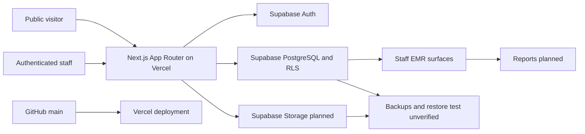

# ESCLARE Production Readiness Audit

Audit date: 2026-07-18

## A. Executive Summary

**Final reconciled weighted score: 5.1/10.** The primary pass calculated 6.1; the independent auditor calculated 5.1. The lower independently verified result is used because production database uncertainty remains.

**Verdict: significant unresolved risks; limited internal testing only.** The public website is substantially more mature than the EMR and scores approximately **8.0/10** on independently reproduced evidence. The combined system is not ready to receive real patient clinical records, clinical photographs, live payments, or package balances.

The score is deliberately capped by missing clinical, consent, payment, package, inventory, finance, reporting, and recovery workflows; unavailable production Supabase verification; no successful restore-test evidence; no production role-by-role negative authorization suite; and no verified critical monitoring. No confirmed critical source-code vulnerability was found in this pass, but production security cannot be certified without database and environment access.

Findings: **3 critical source-design findings mitigated locally but not production-verified, 8 high, 6 medium, and 3 low**. The critical findings remain go-live blockers until the migrations are backed up, applied, and negatively tested against Supabase.

## B. Architecture Summary

Technology: TypeScript strict mode, React 19, Next.js 16 App Router, Zod, Supabase SSR/JS, PostgreSQL migrations and RLS, Vitest, Testing Library, Playwright, Vercel, and OpenNext/Cloudflare build tooling.

Public pages live in `app/(public)`, authentication in `app/(auth)`, staff pages in `app/(staff)`, APIs in `app/api`, domain logic in `lib`, UI in `components`, and database artifacts in `database`.

Source of truth:

| Domain                              | Intended source of truth                               | Current status                                                               |
| ----------------------------------- | ------------------------------------------------------ | ---------------------------------------------------------------------------- |
| Identity/session                    | Supabase Auth                                          | Implemented in code; production configuration not inspected                  |
| Staff roles/branches                | Supabase PostgreSQL + RLS                              | Migrations inspected; production state not queried                           |
| Patients                            | Supabase PostgreSQL                                    | Phase 2 code and migration present; live workflow not verified               |
| Public appointment requests         | Supabase PostgreSQL through server-only service client | Code present; live write not performed to protect production data            |
| Appointments/events                 | Supabase PostgreSQL                                    | Migration/code present; production migration not applied from this workspace |
| Clinical records/photos/consent     | Not implemented                                        | Missing                                                                      |
| Payments/packages/inventory/finance | Not implemented                                        | Missing                                                                      |
| Reports                             | Supabase-derived, planned                              | Missing                                                                      |
| Source/deployment                   | GitHub `main` -> Vercel                                | Existing main deployment verified before this branch                         |
| Backup/recovery                     | Supabase/managed export, planned                       | Not verified; no restore evidence                                            |

## C. Verified System Inventory

Inspected public routes: `/home`, `/about`, `/aftercare`, `/appointment-request`, `/branches`, `/branches/daet`, `/contact`, `/diode-laser`, `/faq`, `/gallery`, `/privacy`, `/terms`, `/treatments`, sitemap, robots, not-found, and public layout/loading states.

Inspected staff/auth routes: `/login`, `/lock`, `/dashboard`, `/appointments`, `/patients`, `/patients/new`, `/patients/[patientId]`, `/services`, `/admin`, `/settings/audit`, plus placeholder clinical, finance, packages, POS, inventory, employees, reports, marketing, integrations, and archived-patient surfaces.

Inspected APIs: `/api/health` and `/api/patients/[patientId]/reveal-contact`. The unused generic `/api/audit` test endpoint was removed.

Inspected database artifacts: nine ordered migrations, five seed files, and three read-only verification queries. RLS is declared for core security, patient, treatment catalog, public requests, appointments, and appointment events. Production policy state and migration history were not queryable.

Environment inventory was limited to `.env.example`; no `.env.local`, Supabase CLI, Vercel CLI, production DB URL, backup credential, or safe role test accounts were available. Secrets were not printed. No committed `.env`, debug log, build output, release archive, or tool scratch directory was found.

## D. Test Results

| ID   | Workflow/check                         | Expected                                         | Actual                                                           | Status/evidence                   |
| ---- | -------------------------------------- | ------------------------------------------------ | ---------------------------------------------------------------- | --------------------------------- |
| T-01 | Format check                           | No drift                                         | Passed after formatting                                          | Passed                            |
| T-02 | ESLint                                 | No lint errors                                   | Passed                                                           | Passed                            |
| T-03 | TypeScript                             | Strict typecheck passes                          | Passed                                                           | Passed                            |
| T-04 | Unit tests                             | Domain and regression tests pass                 | 42/42 passed across 12 files                                     | Passed                            |
| T-05 | Production build                       | Compiles and emits routes                        | 40 pages generated; build passed                                 | Passed                            |
| T-06 | E2E suite                              | Public and development staff flows pass          | 20/20 Chromium tests passed                                      | Passed                            |
| T-07 | Hero failed request                    | Attractive fallback and usable actions           | Poster, heading, and actions remained visible                    | Passed                            |
| T-08 | Hero repeated reload                   | Playback starts consistently                     | 8/8 warm reloads reached `playing`                               | Passed                            |
| T-09 | Responsive hero                        | No overflow/overlap                              | Nine widths from 320 to 1920 px passed automated geometry review | Passed in Chromium                |
| T-10 | Reduced motion                         | Avoid video and retain poster                    | No source attached; poster visible                               | Passed                            |
| T-11 | Media delivery                         | Correct MIME and byte ranges                     | Local and Vercel returned `video/mp4`, `Accept-Ranges`, and 206  | Passed                            |
| T-12 | Production unauthenticated staff route | Redirect to login                                | `/dashboard` returned 307 to `/login`                            | Passed locally in production mode |
| T-13 | Unauthorized contact reveal            | Deny access                                      | Returned 403                                                     | Passed locally in production mode |
| T-14 | Removed arbitrary audit API            | Not routable                                     | Returned 404                                                     | Passed locally in production mode |
| T-15 | Dependency vulnerability scan          | No known moderate+ issue                         | `npm audit` reported 0 vulnerabilities                           | Passed                            |
| T-16 | Production health                      | Live app responds                                | Vercel `/api/health` returned 200 and phase 1 payload            | Passed for pre-audit deployment   |
| T-17 | Supabase RLS role matrix               | Positive and negative tests for every role       | No isolated Supabase test project/accounts                       | Blocked                           |
| T-18 | Production appointment lifecycle       | Transactionally create/transition/cancel/no-show | Migration not verified in production                             | Blocked                           |
| T-19 | Backup restore                         | Controlled restore succeeds                      | No backup credential or restore environment                      | Blocked                           |
| T-20 | Physical mobile/Safari                 | Reliable playback and layout                     | Devices unavailable                                              | Not tested                        |

Test-type warning: staff E2E tests run against development demo context and are not equivalent to real Supabase integration or production role tests.

## E. Findings Register

### Critical findings discovered by independent verification

**CR-001: Basic patient RLS allowed raw contact-column selection.** RLS limited rows but did not mask `mobile`, `secondary_mobile`, or `email`. Local mitigation: `202607181200_sensitive_patient_column_access.sql` revokes table-level patient reads, grants only safe columns including a generated `masked_mobile`, and the application no longer requests raw contact fields. Production status: not applied or negatively tested.

**CR-002: Medical-summary RLS allowed full-row selection.** Row-level policies cannot distinguish summary from full medical columns for the shared Supabase `authenticated` role. Local mitigation: direct authenticated reads of medical, physical, address, and emergency-contact tables are revoked; the server fetches only `alert_level`/`updated_at` for summary permission and explicit fields for full permission. Production status: not applied or negatively tested.

**CR-003: Authenticated staff could forge appointment events.** The original policy allowed any staff member with `appointments.view` to insert history independently of appointment state. Local mitigation: the insert policy and client insert grant are removed; event failures now return a stop-workflow message instead of false success. Remaining risk: state update and event insertion are still separate calls and require a transactional RPC before go-live.

### High findings

**PR-001: Clinical EMR is incomplete.** Affected: `/clinical` and related clinical record domains. Evidence: placeholder page and `docs/clinical-release-readiness.md`. Impact: consultation notes, SOAP notes, treatment history, allergies workflow, consent, signatures, photos, locking, and addenda cannot be safely operated. Required test: full fictional patient clinical journey with role isolation, locking, addenda, and file controls.

**PR-002: Financial and package ledgers are incomplete.** Affected: `/finance`, `/pos`, `/packages`, reporting. Impact: no trustworthy payments, refunds, reversals, package deductions, or reconciliation. Required test: double-entry/idempotent ledger and concurrency suite before use.

**PR-003: Production Supabase schema and RLS are unverified.** Migrations are well structured in source, but no production query, migration history, storage policy, or role-by-role negative test was available. Impact: source inspection cannot prove patient isolation or branch enforcement. Required test: isolated Supabase project with public, receptionist, provider, doctor, manager, admin, owner, and auditor positive/negative cases.

**PR-004: Backup and restore are unverified.** No database/storage backup evidence, retention evidence, RPO/RTO approval, or successful controlled restore record was available. Impact: patient and operational data may be unrecoverable. The score remains below the prompt's 7.5 no-backup cap.

**PR-005: Appointment state and history writes are not transactional.** `app/(staff)/appointments/actions.ts` updates appointment state and then inserts an event/audit record through separate calls. Concurrent updates and partial failures can produce inconsistent history. Required fix: reviewed transactional database function with optimistic concurrency and append-only event creation in one transaction. Required test: two-staff concurrent transition and injected event-write failure.

**PR-006: Production MFA/session controls are not verified.** MFA-required roles exist in the model, but production enrollment, step-up enforcement, invitation, offboarding/session revocation, brute-force controls, and expired-session behavior were not tested. Required test: real safe accounts for every privileged role and direct-route negative checks.

**PR-007: Public appointment writes lack robust abuse/idempotency controls.** The form has Zod validation and a honeypot, but no verified rate limit, replay token, or idempotency key. Impact: automated spam or duplicate requests can consume staff time. Required test: burst, repeated-submit, and retry tests without writing production data.

**PR-017: Direct audit-table insert privileges weakened audit integrity.** The original API grants allowed authenticated users to insert into `audit_events`, while the RLS policy pinned only `actor_employee_id`; other fields could be supplied by the caller. Source hardening now removes the insert policy and direct authenticated/anonymous insert grants, revokes public/anonymous function execution, and adds a read-only ACL verification query. Production remains exposed to the old grants until the new migration is backed up, applied, and verified.

### Medium findings

**PR-008: Monitoring is not established.** No verified error tracker, uptime monitor, failed-login alert, backup alert, storage alert, or critical-workflow alert was found.

**PR-009: Storage and clinical-photo controls are not implemented.** No production bucket/policy/signed-URL evidence was available. This becomes high severity before photos or documents are enabled.

**PR-010: Accessibility evidence is partial.** Semantic/keyboard tests exist for several controls and reduced motion is supported, but no axe/WCAG contrast, 200% zoom, screen-reader, Safari, or physical touch audit was run.

**PR-011: Performance evidence is partial.** Assets are optimized and the hero now uses poster-first metadata preload, but no repeatable Lighthouse/Web Vitals, slow-3G, INP, LCP, or production bundle-budget report was generated.

**PR-012: Browser coverage is Chromium-only.** Firefox, WebKit/Safari, Android Chrome, and Samsung Internet were not available in this pass.

**PR-013: Legal/privacy governance is unresolved.** Privacy and terms pages exist, but Philippine health/privacy retention, breach response, consent language, and staff governance require management and qualified legal/privacy review.

### Low findings

**PR-014: Decorative MP4 retains an AAC audio track.** It is muted and autoplay succeeded in tested Chromium, but a no-audio derivative would reduce unnecessary media work.

**PR-015: `next start` warns with standalone output.** The audit server still ran, and Vercel is unaffected, but local production instructions should eventually use the standalone server artifact or omit standalone output for that workflow.

**PR-016: Generated build/test folders accumulate locally.** They are ignored and not committed. Periodic cleanup is appropriate; they are not source duplication.

### Fixed during this audit

**FIX-001: Hero could expose a non-playing video and lacked a real poster.** Fixed with poster-first playback states, failure handling, reduced-motion behavior, caching, and tests. See `docs/hero-video-reliability-audit-2026-07-18.md`.

**FIX-002: Generic audit test endpoint accepted arbitrary action strings from any staff session.** The unused endpoint was removed and returns 404 in production-mode verification.

**FIX-003: Sensitive contact details could be returned even if the dedicated reveal ledger insert failed.** The route now fails closed with 503 until the access record is successfully written.

**FIX-004: Authenticated users could directly forge non-actor audit fields.** `database/migrations/202607181100_harden_audit_and_api_grants.sql` removes direct audit inserts, removes the unused anonymous appointment-request grant, and revokes default PUBLIC/anonymous function execution. `database/verification/202607181100_harden_audit_and_api_grants_check.sql` verifies the resulting ACLs without changing data.

**FIX-005: Basic patient access exposed raw contact and medical columns.** `database/migrations/202607181200_sensitive_patient_column_access.sql` adds a generated masked contact field, restricts patient column grants, and removes direct authenticated reads from sensitive child tables. Application queries now request only masked/basic data and fetch permission-scoped medical fields through the server.

**FIX-006: Appointment events were directly client-writable and partial failures were silent.** The hardening migration revokes direct event inserts. Appointment actions now surface event/audit failures with explicit no-retry/stop-workflow messages. Full transactionality remains unresolved.

**FIX-007: Production patient helpers could fall back to fictional demo records when server configuration was incomplete.** Patient directory, profile, audit, and full-contact helpers now return empty/not-found in production instead of substituting development data.

## F. Prioritized Remediation Plan

### Immediate: production gates

1. Keep real clinical records, photos, payments, and package balances disabled.
2. Create and verify database plus storage backups; perform a non-production restore drill.
3. Apply and verify migrations only after backup, using the existing rollout runbook and read-only verification SQL.
4. Build an isolated Supabase integration environment and execute role-by-role RLS negative tests.
5. Move appointment transitions and event creation into a single reviewed database transaction.

### Phase 1: security and operational reliability

1. Verify privileged MFA, staff invitation, role change, suspension, offboarding, and session revocation.
2. Add rate limiting and idempotency to public appointment requests.
3. Add production-safe error, uptime, auth-failure, backup, and deployment monitoring.
4. Establish protected development, staging, and production data separation.

### Phase 2: clinical integrity

1. Implement encounter shell, SOAP notes, treatment templates, allergies/contraindications, consent/version capture, signatures, record locking, addenda, and clinical photo controls.
2. Add immutable clinical audit history and emergency-access policy.
3. Validate workflows with fictional patients and independent clinical governance review.

### Phase 3: finance and operations

1. Implement append-only payment, refund, reversal, package, and session ledgers.
2. Add inventory movements, reconciliation, reports, and direct-query total verification.
3. Add concurrent edit and duplicate-submission tests.

### Phase 4: quality toward 9.8

1. Physical-device/browser matrix, WCAG 2.2 AA audit, Web Vitals budgets, and slow-network tests.
2. Restore drills, incident response exercise, release tags, branch protection, required CI checks, and rollback drill.
3. Independent security/privacy/legal review and documented risk acceptance.

## G. Primary Weighted Score

| Category                                  | Weight | Score | Weighted result | Evidence and remaining risk                                                                            |
| ----------------------------------------- | -----: | ----: | --------------: | ------------------------------------------------------------------------------------------------------ |
| EMR data integrity and clinical workflows |    15% |   3.5 |           0.525 | Patient/scheduling foundations exist; clinical, finance, package, consent, and photo workflows missing |
| Security and privacy                      |    15% |   6.5 |           0.975 | Server-only secrets, RLS migrations, masking, audit design; no production negative tests/legal review  |
| Authentication and authorization          |    10% |   6.0 |           0.600 | Server guard and permission matrix inspected; MFA/session/offboarding not production-tested            |
| Database and Supabase architecture        |    10% |   6.5 |           0.650 | Ordered migrations, constraints, RLS; production state/storage unavailable                             |
| Reliability and error handling            |     8% |   6.5 |           0.520 | Hero/fallback and validation improved; nontransactional appointment history remains                    |
| Backup and disaster recovery              |     8% |   2.0 |           0.160 | Runbook exists; no verified backup or restore                                                          |
| Website functionality                     |     6% |   8.8 |           0.528 | Public E2E and live smoke strong; real notification delivery/cross-browser incomplete                  |
| UI/UX and design consistency              |     6% |   8.8 |           0.528 | Premium responsive website and usable staff shell; many EMR modules are placeholders                   |
| Performance                               |     5% |   7.5 |           0.375 | Optimized images/media strategy; no lab Web Vitals or slow-network measurements                        |
| Testing and QA coverage                   |     7% |   7.5 |           0.525 | 38 unit + 20 Chromium E2E; no real Supabase integration or physical-device suite                       |
| Deployment and DevOps                     |     4% |   7.5 |           0.300 | Clean Git history and healthy Vercel deployment; branch protection/rollback not verified               |
| Accessibility                             |     3% |   7.0 |           0.210 | Labels, keyboard interactions, reduced motion; no formal WCAG audit                                    |
| SEO                                       |     2% |   8.0 |           0.160 | Metadata, sitemap, robots, local content; no external crawl/search-console evidence                    |
| Monitoring and observability              |     1% |   2.0 |           0.020 | Health endpoint exists; critical monitoring/alerting unverified                                        |

**Primary calculated total: 6.08, reported as 6.1/10. Confidence: medium for source/local website quality, low for production EMR readiness because Supabase and backup evidence are unavailable.**

## H. Primary Agent vs. Independent Auditor

| Category                     | Primary | Independent | Final |
| ---------------------------- | ------: | ----------: | ----: |
| EMR integrity/workflows      |     3.5 |         3.0 |   3.0 |
| Security/privacy             |     6.5 |         4.0 |   4.0 |
| Authentication/authorization |     6.0 |         5.0 |   5.0 |
| Database/Supabase            |     6.5 |         5.5 |   5.5 |
| Reliability                  |     6.5 |         6.0 |   6.0 |
| Backup/recovery              |     2.0 |         2.0 |   2.0 |
| Website functionality        |     8.8 |         8.0 |   8.0 |
| UI/UX                        |     8.8 |         8.0 |   8.0 |
| Performance                  |     7.5 |         6.5 |   6.5 |
| Testing/QA                   |     7.5 |         6.5 |   6.5 |
| Deployment/DevOps            |     7.5 |         5.5 |   5.5 |
| Accessibility                |     7.0 |         6.5 |   6.5 |
| SEO                          |     8.0 |         7.5 |   7.5 |
| Monitoring                   |     2.0 |         2.0 |   2.0 |

**Independent weighted total: 5.07, reported and adopted as 5.1/10.**

Accepted claims: EMR/finance incompleteness, missing backup/restore/MFA/monitoring evidence, server guard behavior, hero poster/fallback improvement, and source audit-grant hardening.

Rejected claim: the primary statement that no critical source-design vulnerability was found. The independent auditor correctly demonstrated that row-level policies did not mask raw contact or full medical columns.

Partially accepted claims: hero reliability, audit integrity, website score, and E2E confidence. Chromium evidence is strong, but physical devices, production deployment of this branch, Supabase negative tests, and transactional appointment history remain missing.

Independently reproduced: TypeScript, ESLint, Prettier, 38 pre-reconciliation unit tests, five warm hero reloads, and route-return playback. After reconciliation, the primary agent reran 42/42 unit tests, 20/20 E2E tests, and the production build.

## I. Remaining Risks

The combined system must not be presented as a completed EMR. The largest risks are data recovery, production authorization/RLS uncertainty, incomplete clinical and financial domains, nontransactional appointment history, missing storage controls, and absent monitoring. The public website can continue as a preview/marketing surface, provided appointment requests are treated as unconfirmed inquiries and no sensitive clinical data is collected there.

## J. Go-Live Checklist

| Gate                                                   | Status                     |
| ------------------------------------------------------ | -------------------------- |
| Public website build, unit, and Chromium E2E           | Passed                     |
| Hero poster/failure/reduced-motion regression coverage | Passed in Chromium         |
| Live pre-audit Vercel health and media delivery        | Passed                     |
| New audit branch deployed and matched to commit        | Blocked until publish step |
| Production Supabase migrations verified                | Blocked                    |
| Role-by-role RLS positive and negative tests           | Not tested                 |
| Privileged MFA verified                                | Not tested                 |
| Database and storage backup verified                   | Not tested                 |
| Controlled restore drill                               | Not tested                 |
| Clinical encounter/consent/photo workflow              | Failed: missing            |
| Payment/package/refund/reversal ledgers                | Failed: missing            |
| Monitoring and incident alerts                         | Failed: not established    |
| Physical mobile/Safari/Firefox coverage                | Not tested                 |
| Legal/privacy governance approval                      | Not tested                 |

## K. Final Verdict

**Significant unresolved risks; limited internal testing only.** The website is suitable for controlled preview and public marketing after deployment verification. The EMR is not ready for real patient clinical data, photos, payments, or package balances. A 9.8 rating is not supportable until the new migrations are backed up/applied/negatively tested, backup restore succeeds, appointment history becomes transactional, and the missing MFA, monitoring, clinical, financial, storage, cross-browser, and governance gates pass with evidence.
